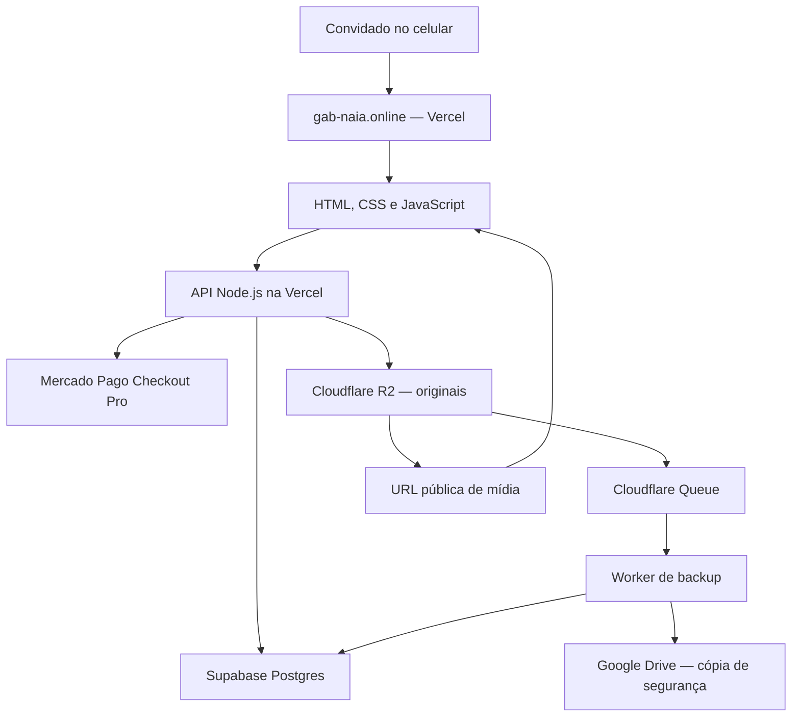
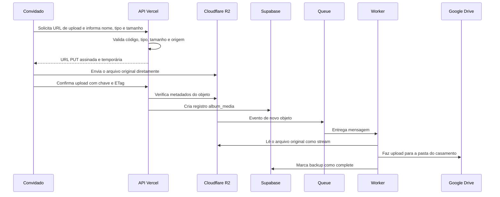

# Projeto completo — Convite de casamento de Gabriel & Halanaia

> Documento mestre do produto, da arquitetura, das decisões e do planejamento.
>
> Última atualização: 20 de julho de 2026  
> Data do casamento: 28 de novembro de 2026  
> Site oficial: <https://gab-naia.online>  
> Repositório: `GabsDomin/Convite`  
> Situação geral: convite publicado; melhorias de RSVP implementadas; álbum coletivo em evolução; infraestrutura R2 criada; backup no Google Drive ainda precisa das credenciais OAuth.

---

## 1. Resumo executivo

O projeto é uma experiência digital completa para o casamento de Gabriel e Halanaia. Ele começou como um convite online e evoluiu para uma pequena plataforma do evento, reunindo:

- convite responsivo e elegante;
- informações da cerimônia e do jantar;
- contagem regressiva até o início do dia do casamento;
- confirmação de presença individual, por casal ou por responsável com menores;
- controle privado de pessoas que não podem confirmar presença;
- lista de presentes com reserva presencial e pagamento online pelo Mercado Pago;
- álbum coletivo em que os convidados podem fotografar, gravar, enviar e visualizar as memórias uns dos outros;
- armazenamento dos originais no Cloudflare R2;
- catálogo e metadados no Supabase;
- backup automático dos arquivos originais no Google Drive;
- publicação do site e da API na Vercel;
- domínio personalizado `gab-naia.online`.

O objetivo é oferecer uma experiência bonita, simples e confiável, principalmente em celulares, sem exigir que os convidados instalem um aplicativo. A solução deve atender aproximadamente 160 convidados, preservar a boa qualidade das fotos e vídeos e manter o custo operacional muito baixo.

---

## 2. Visão do produto

### 2.1 Objetivo principal

Centralizar em um único endereço tudo o que um convidado precisa antes, durante e depois do casamento:

1. conhecer os detalhes do evento;
2. confirmar presença;
3. acessar a localização;
4. escolher um presente, se desejar;
5. registrar fotos e vídeos durante o evento;
6. acompanhar as memórias compartilhadas pelos outros convidados.

### 2.2 Princípios do projeto

- **Mobile first:** a maioria dos convidados acessará pelo celular.
- **Baixo atrito:** nenhuma instalação deve ser necessária.
- **Visual afetivo e elegante:** azul royal, branco, elementos florais e tipografia de convite.
- **Presentes sem pressão:** confirmar presença não deve parecer uma cobrança por presente.
- **Qualidade de mídia:** o original enviado deve ser preservado.
- **Custo controlado:** aproveitar os planos gratuitos e a capacidade de 1 TB já disponível no Google Drive.
- **Privacidade dos segredos:** credenciais nunca ficam no navegador ou no repositório.
- **Experiência coletiva:** as fotos publicadas aparecem para os demais convidados sem fila de aprovação.
- **Evolução progressiva:** recursos administrativos e otimizações podem ser adicionados sem reconstruir o projeto.

### 2.3 Público e escala esperada

- Aproximadamente 160 convidados.
- Nem todos utilizarão o álbum.
- A maior concentração de acessos e uploads acontecerá no dia do casamento.
- Haverá uma mistura de aparelhos Android e iPhone, navegadores e capacidades de câmera diferentes.
- Fotos serão muito mais comuns que vídeos, mas vídeos são aceitos e podem representar a maior parte do armazenamento.

---

## 3. Informações oficiais do evento

| Item | Informação atual |
|---|---|
| Casal | Gabriel & Halanaia |
| Data | 28 de novembro de 2026 |
| Início considerado pela contagem | 00:00 no fuso de São Paulo (`2026-11-28T00:00:00-03:00`) |
| Cerimônia | Horário a confirmar |
| Recepção | Jantar após a cerimônia |
| Endereço | Rua José Marques Ribeiro, 521 |
| Bairro e cidade | Guaturinho — Cajamar/SP |
| CEP | 07750-000 |
| Google Maps | <https://maps.app.goo.gl/rGEtAHSXq4ArMM4o7> |
| Domínio | <https://gab-naia.online> |

Os textos do convite evitam referências a padrinhos ou orientações de traje. A programação pode ser atualizada assim que o horário da cerimônia estiver definido.

---

## 4. Escopo funcional atual

### 4.1 Convite principal

O convite principal possui:

- cabeçalho com o nome do casal;
- data e local do casamento;
- contagem regressiva por dias;
- cards com cerimônia, jantar e programação;
- endereço completo e botão para abrir a rota no Google Maps;
- botão para confirmação de presença;
- acesso à lista de presentes;
- acesso aos detalhes do convite depois da confirmação;
- chamada para o álbum coletivo;
- música ambiente com controle de reprodução/som;
- layout responsivo para celular e desktop.

#### Regra da contagem regressiva

A contagem usa `28/11/2026 às 00:00`, no fuso `America/Sao_Paulo`. Assim, “faltam N dias” representa corretamente quantas viradas de dia faltam para a data do casamento, sem depender do horário ainda não confirmado da cerimônia.

### 4.2 Confirmação de presença — RSVP

O formulário permite três formatos:

- **Somente minha presença**;
- **Eu e meu/minha companheiro(a)**;
- **Eu e menor(es) sob minha responsabilidade**.

Regras implementadas:

- no casal, é obrigatório informar exatamente o nome do companheiro ou companheira;
- no grupo com menores, é possível informar de 1 a 6 nomes;
- o nome principal não pode ser repetido entre os acompanhantes;
- o mesmo acompanhante não pode aparecer duas vezes;
- uma pessoa já confirmada não pode ser incluída novamente por outra confirmação;
- uma nova confirmação com o mesmo nome principal atualiza o registro existente;
- nomes são limpos e normalizados para reduzir diferenças de maiúsculas, acentos e espaços;
- a lista restrita é verificada tanto para o nome principal quanto para todos os nomes adicionais.

#### Decisão de comunicação

A regra de que adultos confirmam separadamente não precisa ser destacada como uma advertência agressiva. O fluxo já protege os dados: se um nome bloqueado for incluído, a confirmação será recusada. O texto de interface deve ser curto, acolhedor e suficiente para orientar o preenchimento.

O código atual ainda contém uma explicação explícita sobre maiores de 18 anos no formulário. A remoção ou suavização desse texto faz parte do acabamento de conteúdo, sem alterar as validações do backend.

### 4.3 Lista privada de pessoas impedidas de confirmar

Existe a tabela privada `restricted_guests`. Ela serve para armazenar nomes que não devem conseguir concluir a confirmação.

Características:

- não é exposta ao navegador;
- só o backend, usando a credencial de serviço do Supabase, pode consultá-la;
- suporta observação interna e ativação/desativação do bloqueio;
- normaliza acentos, caixa e espaços;
- permite cadastrar variações como registros separados quando necessário;
- a resposta pública é sempre: **“Infelizmente, seu nome não está na lista de convidados.”**

Essa mensagem não revela se o problema foi o nome principal ou um dos nomes adicionais.

### 4.4 Lista de presentes

O catálogo possui presentes de valor fixo e presentes divididos em cotas.

Recursos:

- categorias e seções de presentes;
- itens tradicionais e itens bem-humorados;
- presentes fixos, que só podem ser escolhidos uma vez;
- cotas com valores predefinidos;
- acompanhamento do valor já contribuído em cada cota;
- reserva para entrega presencial;
- pagamento online pelo Mercado Pago Checkout Pro;
- bloqueio temporário de item enquanto um pagamento está pendente;
- cancelamento de reservas de pagamento expiradas;
- páginas de retorno para pagamento aprovado, pendente ou com erro.

#### Fluxo de pagamento

1. O convidado escolhe um presente ou cota.
2. A API cria uma ordem interna no Supabase.
3. A API cria uma preferência no Mercado Pago.
4. O convidado conclui o pagamento no ambiente do Mercado Pago.
5. O Mercado Pago chama o webhook do projeto.
6. A API valida a assinatura do webhook.
7. A API consulta o pagamento diretamente no Mercado Pago.
8. Somente depois da confirmação oficial o presente é marcado como reservado/pago.

Esse desenho reduz o risco de alguém falsificar uma confirmação de pagamento chamando o webhook manualmente.

### 4.5 Álbum coletivo

O álbum fica em `/album` e foi pensado como uma experiência de rede social privada do evento.

#### Experiência visual planejada e parcialmente implementada

- cabeçalho compacto para celular;
- carrossel de fotos com o texto “Gabriel & Halanaia”;
- stories agrupados por convidado;
- fotos e vídeos em tela cheia;
- galeria em grid com inspiração em Pinterest e Dots Memories;
- filtros por etapa:
  - Todos;
  - Preparativos;
  - Cerimônia;
  - Jantar;
  - Festa;
- botão destacado para enviar mídia;
- botão para abrir a câmera do próprio site;
- compartilhamento de uma mídia para outros aplicativos usando o menu nativo do celular.

#### Regras do álbum

- todos os convidados podem visualizar as fotos publicadas pelos demais;
- não há aprovação manual antes da publicação;
- o convidado informa seu nome e a categoria da memória;
- o upload pode exigir o código compartilhado do álbum;
- o original é preservado no armazenamento;
- a galeria recebe um registro somente depois que o backend verifica o arquivo enviado;
- o limite técnico atual por arquivo é de **500 MB**;
- imagens e vídeos são aceitos.

#### Câmera no navegador

A câmera personalizada busca uma experiência parecida com a do Instagram:

- escolha entre câmera frontal e traseira;
- captura de foto;
- gravação de vídeo com `MediaRecorder` quando suportado;
- áudio do microfone durante o vídeo;
- zoom quando o aparelho/navegador expõe esse controle;
- lanterna quando suportada pelo aparelho;
- uso de `ImageCapture` para melhor qualidade quando disponível;
- fallback por `canvas` quando a API avançada não existe;
- alternativa de seleção de arquivo da galeria do aparelho.

As capacidades não são idênticas em todos os aparelhos. iPhone/Safari e Android/Chrome podem oferecer controles diferentes, então a interface precisa esconder ou desabilitar apenas o recurso não suportado, mantendo foto, vídeo ou seleção de arquivo disponíveis.

#### Compartilhamento no Instagram

Um site comum não consegue publicar silenciosamente um story diretamente na conta pessoal do Instagram. O comportamento compatível é:

1. preparar a mesma foto/story em formato vertical `1080 × 1920`;
2. abrir o menu nativo de compartilhamento do celular;
3. o convidado escolher Instagram;
4. dentro do aplicativo, escolher Stories e concluir a postagem.

O que deve ser compartilhado é a mídia atual, não um link genérico para o álbum.

---

## 5. Arquitetura geral



### 5.1 Responsabilidade de cada serviço

| Serviço | Responsabilidade |
|---|---|
| Vercel | Hospedar o frontend, executar a API Node.js, realizar deploys e servir o domínio principal |
| Supabase | Armazenar RSVP, lista restrita, presentes, reservas, pagamentos e metadados do álbum |
| Mercado Pago | Processar pagamentos da lista de presentes |
| Cloudflare R2 | Armazenar os arquivos originais do álbum e entregá-los pela internet |
| Cloudflare Queue | Desacoplar o upload do processo de backup |
| Cloudflare Worker | Ler o arquivo do R2, enviá-lo ao Drive e atualizar o status no Supabase |
| Google Drive | Guardar a segunda cópia dos arquivos originais |
| GitHub | Versionar o código e alimentar os deploys da Vercel |

### 5.2 Por que essa arquitetura faz sentido

- O navegador envia o arquivo diretamente ao R2 e evita usar a memória/banda da função da Vercel para transportar centenas de megabytes.
- O Supabase guarda somente dados estruturados e referências, não os arquivos pesados.
- A galeria lê a mídia do R2, que é adequado para servir objetos e não cobra transferência direta para a internet.
- O Drive é backup, não servidor da galeria; isso evita lentidão, interface do Google e limites inadequados para uma experiência pública.
- O backup acontece de forma assíncrona: uma falha temporária no Drive não precisa bloquear o upload do convidado.

---

## 6. Fluxo técnico do upload e backup



### 6.1 Estados do backup

| Estado | Significado |
|---|---|
| `pending` | Arquivo existe no R2 e aguarda cópia |
| `processing` | Worker iniciou o processamento |
| `complete` | Arquivo foi salvo no Drive |
| `error` | As tentativas falharam e exigem nova tentativa ou análise |
| `not_applicable` | Registro antigo de outro provedor, sem backup R2 aplicável |

O Worker possui:

- consumidor da fila `gab-naia-drive-backup`;
- até 5 novas tentativas por mensagem;
- dead-letter queue `gab-naia-drive-backup-dead`;
- tarefa agendada a cada 15 minutos para reconciliar backups pendentes ou com erro;
- observabilidade de logs e traces.

---

## 7. Backend e API

O backend está em `server.js`, com entrada compatível com a Vercel por `server.ts`.

| Método | Endpoint | Função |
|---|---|---|
| `GET` | `/api/config` | Retorna apenas configurações públicas e informa se integrações estão disponíveis |
| `GET` | `/api/album/media` | Lista mídias publicadas do álbum |
| `POST` | `/api/album/upload-signature` | Valida a solicitação e gera URL temporária para upload direto no R2 |
| `POST` | `/api/album/media` | Verifica o objeto enviado e cadastra seus metadados |
| `GET` | `/api/gifts` | Retorna o catálogo público e situação dos presentes |
| `POST` | `/api/rsvp` | Cria ou atualiza uma confirmação de presença |
| `POST` | `/api/gifts/reserve` | Registra uma reserva presencial |
| `POST` | `/api/mercadopago/create-preference` | Cria ordem interna e preferência de pagamento |
| `POST` | `/api/webhooks/mercadopago` | Processa notificações autenticadas do Mercado Pago |

### 7.1 Controles aplicados pela API

- validação de origem para ações sensíveis;
- limite de tamanho dos corpos JSON;
- normalização e validação dos campos;
- segredos acessíveis apenas no servidor;
- URLs assinadas com expiração curta;
- vínculo do upload com nome, tamanho, tipo e chave esperados;
- verificação do objeto e do `ETag` antes de gravar os metadados;
- lista explícita de arquivos públicos; arquivos SQL, Git e configurações não são servidos;
- respostas públicas sem chaves, tokens ou detalhes internos desnecessários.

---

## 8. Banco de dados

### 8.1 Tabelas principais

| Tabela | Conteúdo |
|---|---|
| `rsvps` | Nome principal, tipo de confirmação, nomes adicionais e datas |
| `restricted_guests` | Pessoas impedidas de confirmar, observação interna e status |
| `gifts` | Catálogo, tipo, valor/meta, categoria e disponibilidade |
| `gift_reservations` | Reservas presenciais ou originadas de pagamento confirmado |
| `payment_orders` | Estado de cada tentativa de pagamento no Mercado Pago |
| `album_media` | Autor, categoria, tipo, tamanho, chave R2, dimensões e estado do backup |

### 8.2 Segurança no Supabase

- Row Level Security está habilitado nas tabelas sensíveis.
- Acesso direto por `anon` e `authenticated` é revogado.
- O navegador não recebe `service_role` ou `SUPABASE_SECRET_KEY`.
- Operações são feitas por funções SQL protegidas e chamadas pelo backend.
- Funções `security definer` usam `search_path` explícito.

### 8.3 Ordem recomendada dos scripts SQL

1. `supabase-schema.sql`
2. `supabase-functions.sql`
3. `supabase-payments.sql`
4. `supabase-restricted-guests.sql`
5. `supabase-rsvp-guests.sql`
6. `supabase-album-schema.sql`
7. `seed_gifts.sql`, quando for necessário reaplicar/atualizar o catálogo

Os scripts posteriores funcionam como migrações e substituem funções antigas por versões mais completas.

---

## 9. Variáveis de ambiente

Nunca salvar valores reais de segredos neste documento, no GitHub ou em arquivos públicos.

### 9.1 Vercel — aplicação principal

| Variável | Secreta? | Uso | Estado em 20/07/2026 |
|---|---:|---|---|
| `SUPABASE_URL` | Não | Endereço do projeto Supabase | Configurada |
| `SUPABASE_SECRET_KEY` | Sim | Acesso servidor ao Supabase | Configurada |
| `SITE_URL` | Não | URL canônica do site | Configurada como `https://gab-naia.online` |
| `MERCADO_PAGO_ACCESS_TOKEN` | Sim | Criação e consulta de pagamentos | Configurada |
| `MERCADO_PAGO_WEBHOOK_SECRET` | Sim | Validação da assinatura do webhook | Configurada |
| `R2_ACCOUNT_ID` | Sensível | Conta usada pelo endpoint S3 | Configurada |
| `R2_ACCESS_KEY_ID` | Sim | Identificação da credencial R2 | Configurada |
| `R2_SECRET_ACCESS_KEY` | Sim | Segredo da credencial R2 | Configurada |
| `R2_BUCKET_NAME` | Não | Nome do bucket | Configurada como `gab-naia-album` |
| `R2_PUBLIC_BASE_URL` | Não | Base das URLs públicas das mídias | Configurada temporariamente com `r2.dev` |
| `R2_IMAGE_TRANSFORM_BASE_URL` | Não | Base opcional para transformações de imagem | Não configurar enquanto não houver domínio/serviço de transformação validado |
| `ALBUM_UPLOAD_SIGNING_SECRET` | Sim | Assina os pedidos de upload do álbum | Configurada |
| `ALBUM_UPLOAD_CODE` | Sim/compartilhada | Código entregue apenas aos convidados | Configurada |
| `BACKEND_URL` | Não | API em domínio separado | Desnecessária enquanto frontend e API estiverem no mesmo domínio |

As variáveis R2 foram adicionadas à Vercel, mas é necessário fazer um novo deploy de produção para que a função publicada carregue os valores atualizados.

### 9.2 Cloudflare Worker — backup no Drive

| Variável/Binding | Secreta? | Estado |
|---|---:|---|
| `SUPABASE_URL` | Não | Configurada em `wrangler.jsonc` |
| `SUPABASE_SECRET_KEY` | Sim | Configurada como secret do Worker |
| `GOOGLE_DRIVE_CLIENT_ID` | Sim | Pendente |
| `GOOGLE_DRIVE_CLIENT_SECRET` | Sim | Pendente |
| `GOOGLE_DRIVE_REFRESH_TOKEN` | Sim | Pendente |
| `GOOGLE_DRIVE_FOLDER_ID` | Sensível | Pendente |
| `ALBUM_BUCKET` | Binding | Ligado ao bucket `gab-naia-album` |

O Worker já está publicado e saudável, mas o backup não será concluído enquanto as quatro configurações do Google Drive estiverem pendentes.

---

## 10. Infraestrutura atual

### 10.1 Vercel

- Projeto: `gab-naia`
- Equipe/escopo: `gabsdomins-projects`
- Repositório conectado: `GabsDomin/Convite`
- Branch de produção: `main`
- Domínio: `gab-naia.online`
- HTTPS: gerenciado pela Vercel
- Deploy automático: push na branch principal
- Situação: convite está publicado; as novas variáveis do R2 aguardam redeploy para o álbum aparecer como configurado em produção.

### 10.2 Supabase

- Projeto configurado e usado pelo backend.
- Armazena dados relacionais e metadados.
- Não deve armazenar os binários pesados do álbum.
- Scripts de schema e migração estão versionados no repositório.

### 10.3 Cloudflare R2

- Bucket: `gab-naia-album`
- Classe: Standard
- Região automática: ENAM
- Prefixo de originais: `gab-naia/album/originals/`
- CORS autorizado para:
  - `https://gab-naia.online`;
  - `http://127.0.0.1:3000`;
  - `http://localhost:3000`.
- Métodos CORS: `GET`, `HEAD` e `PUT`.
- URL pública atual: domínio de desenvolvimento `r2.dev`.
- Próximo passo de produção: criar `media.gab-naia.online` e substituir a URL de desenvolvimento.

O domínio `r2.dev` é útil para testes, mas a própria Cloudflare o posiciona como endpoint de desenvolvimento. O domínio personalizado melhora controle, identidade e preparação para cache/transformações.

### 10.4 Cloudflare Queues e Worker

- Fila principal: `gab-naia-drive-backup`
- Dead-letter queue: `gab-naia-drive-backup-dead`
- Worker: `gab-naia-drive-backup`
- Endpoint de saúde: `https://gab-naia-drive-backup.gab-naia.workers.dev`
- Notificação R2 ativa para criação/cópia/conclusão de objetos no prefixo de originais.
- Cron de reconciliação: a cada 15 minutos.

### 10.5 Google Drive

- Capacidade informada pelo proprietário: 1 TB.
- Papel no projeto: backup dos originais.
- Não é usado para renderizar diretamente a galeria.
- Integração OAuth ainda precisa ser concluída.

---

## 11. Custos e capacidade

> Valores e limites mudam com o tempo. Esta análise foi atualizada em 20/07/2026 e deve ser revisada antes do evento.

### 11.1 Cloudflare R2

Na classe Standard, a Cloudflare informa atualmente:

- 10 GB-mês de armazenamento gratuito por mês;
- 1 milhão de operações Class A gratuitas por mês;
- 10 milhões de operações Class B gratuitas por mês;
- transferência direta para a internet sem cobrança de egress;
- acima da franquia, armazenamento por US$ 0,015 por GB-mês, além das operações excedentes.

Fonte oficial: <https://developers.cloudflare.com/r2/pricing/>

Para 160 convidados, o número de operações provavelmente ficará muito abaixo das franquias. O fator que mais influencia custo é o volume total dos originais, especialmente vídeos.

### 11.2 Exemplos de volume

| Cenário ilustrativo | Cálculo | Volume aproximado no R2 |
|---|---|---:|
| Leve | 40 participantes × 8 fotos × 6 MB | 1,9 GB |
| Provável | 70 participantes × 12 mídias × 8 MB | 6,6 GB |
| Intenso, só fotos | 100 participantes × 15 fotos × 10 MB | 15 GB |
| Com vídeos | 80 participantes × 10 fotos de 8 MB + 2 vídeos de 80 MB | 19,2 GB |

Esses exemplos não são previsão; servem para mostrar que os vídeos, e não a quantidade de convidados isoladamente, determinam a maior variação.

Mantendo 15 GB por um mês, apenas cerca de 5 GB ficariam acima da franquia de armazenamento. Pela tarifa oficial atual, isso representaria aproximadamente **US$ 0,075 no mês**, antes de impostos e arredondamentos. Em 20 GB, seriam aproximadamente **US$ 0,15 no mês** acima da franquia. As operações previstas para este evento tendem a continuar dentro da faixa gratuita.

### 11.3 Worker e filas

O plano gratuito de Workers inclui atualmente 100 mil requisições por dia. Queues inclui 10 mil operações por dia no plano gratuito; uma mensagem normalmente consome operações de escrita, leitura e exclusão, além de leituras extras em caso de repetição.

Fontes oficiais:

- <https://developers.cloudflare.com/workers/platform/pricing/>
- <https://developers.cloudflare.com/queues/platform/pricing/>

Para centenas ou poucos milhares de arquivos, a expectativa é permanecer dentro dos limites gratuitos. Falhas contínuas no Drive podem aumentar repetições; por isso a integração deve estar pronta antes de liberar uploads em produção.

### 11.4 Vercel

O plano Hobby é gratuito e destinado a projetos pessoais e não comerciais. O convite se enquadra como projeto pessoal enquanto não houver uso comercial. Se o projeto passar a prestar serviço, vender acesso ou atender terceiros, o plano precisa ser reavaliado.

Fonte oficial: <https://vercel.com/docs/plans/hobby>

### 11.5 Supabase

O plano gratuito atual inclui 500 MB de banco por projeto. Como o Supabase guarda apenas registros e metadados, não os arquivos do álbum, 160 convidados representam um volume relacional pequeno. Ainda assim, o painel de uso deve ser acompanhado.

Fonte oficial: <https://supabase.com/docs/guides/platform/billing-on-supabase>

### 11.6 Google Drive

Como já existe um plano com 1 TB, o custo incremental esperado é zero enquanto o backup permanecer dentro dessa capacidade e o plano atual for mantido. O Drive armazena uma cópia adicional; portanto, cada 10 GB no R2 também consumirá aproximadamente 10 GB no Drive.

### 11.7 Mercado Pago

Não há mensalidade de infraestrutura do projeto para o Checkout Pro, mas cada pagamento aprovado pode gerar tarifa do Mercado Pago. A taxa depende do método, parcelamento e prazo de recebimento configurados na conta, por isso deve ser consultada no painel no momento da operação.

Fonte oficial: <https://www.mercadopago.com.br/developers/pt/docs/getting-started>

### 11.8 Conclusão de custo

Para o tamanho previsto do casamento, é realista esperar custo de hospedagem e infraestrutura próximo de zero, além do domínio e dos serviços que já estão contratados. Isso não é garantia de custo zero: vídeos longos, acessos automatizados, mudança de planos ou retenção por muitos meses podem ultrapassar as franquias.

---

## 12. Segurança, privacidade e moderação

### 12.1 Segredos

- Nunca colocar tokens reais em HTML, JavaScript do navegador, screenshots públicas ou commits.
- Usar Vercel Environment Variables e `wrangler secret put`.
- Revogar e substituir qualquer segredo que tenha sido publicado ou enviado para terceiros.
- Manter credenciais separadas por serviço e com o menor privilégio necessário.

### 12.2 Acesso ao álbum

O código do álbum reduz uploads casuais, mas não transforma sozinho a galeria em um sistema privado completo. Se a página e as URLs forem públicas, uma pessoa com o endereço poderá visualizar as mídias.

Antes do evento, deve ser tomada uma decisão explícita entre:

- **acesso simples:** link e código compartilhado apenas com os convidados;
- **acesso protegido:** autenticação/sessão para também bloquear a leitura da galeria;
- **acesso público:** qualquer pessoa com o link pode visualizar.

Para este casamento, a preferência atual é baixa fricção e visualização coletiva. Mesmo assim, é recomendável adicionar:

- aviso curto de que a mídia ficará visível aos demais convidados;
- canal para solicitar remoção;
- ação administrativa para ocultar/excluir conteúdo inadequado;
- política simples sobre imagens de crianças;
- limitação de tentativas do código de upload;
- proteção contra automação/bots se houver tráfego abusivo.

### 12.3 Ausência de aprovação prévia

A decisão atual é publicar imediatamente, sem moderação antes da exibição. Isso melhora a experiência ao vivo, mas cria riscos:

- conteúdo inadequado aparece imediatamente;
- uploads acidentais precisam de remoção posterior;
- alguém com o código pode enviar conteúdo em nome de outro convidado;
- não há garantia de consentimento de todas as pessoas fotografadas.

A recomendação não é criar uma fila de aprovação, e sim uma **moderação posterior simples**, exclusiva do casal, com ocultar, excluir e bloquear upload abusivo.

### 12.4 Backup não é sincronização bidirecional

O Drive é uma cópia de segurança. Excluir um arquivo do Drive não deve remover o original do R2 automaticamente, e excluir no R2 não deve ser considerado uma estratégia de organização do Drive. Uma política de retenção deve ser definida depois do casamento.

---

## 13. Qualidade, desempenho e experiência mobile

### 13.1 Preservação do original

- O upload armazena o arquivo original no R2.
- O backup envia o mesmo conteúdo para o Drive.
- Compressões de visualização futuras não devem substituir o original.
- Metadados de tamanho, tipo, dimensões e duração ajudam a auditar o acervo.

### 13.2 Derivados para galeria

Carregar originais de 10–50 MB diretamente na grade deixa o álbum lento e consome bateria/dados móveis. O desenho ideal é:

- original: R2 e Drive;
- miniatura: leve, para a grade;
- versão de tela: otimizada para abrir no story/lightbox;
- original: baixado apenas quando o convidado solicitar.

O domínio `media.gab-naia.online` deve ser criado antes de ativar transformações. `R2_IMAGE_TRANSFORM_BASE_URL` deve continuar vazio enquanto esse fluxo não estiver validado.

### 13.3 Upload resiliente

Antes do casamento, o upload deve ser testado com:

- Wi-Fi bom, Wi-Fi ruim e 4G/5G;
- arquivo pequeno e próximo do limite;
- foto HEIC de iPhone;
- JPEG, PNG e WebP;
- vídeo MP4 e vídeo gerado pelo navegador;
- interrupção de rede;
- troca de aba ou bloqueio de tela;
- vários uploads seguidos;
- dois convidados enviando ao mesmo tempo.

Para arquivos grandes, upload multipart e retomável é uma evolução recomendada. A implementação atual por `PUT` único é simples e preserva qualidade, mas uma queda de conexão exige reiniciar aquele arquivo.

### 13.4 Acessibilidade

- botões devem ter rótulos claros;
- controles da câmera precisam de `aria-label`;
- contraste deve ser testado sobre fotos;
- modais devem prender foco e fechar pelo teclado;
- não depender apenas de cor para indicar estados;
- respeitar `prefers-reduced-motion` nos carrosséis e stories;
- mensagens de sucesso e erro devem ser anunciadas por leitores de tela.

---

## 14. Testes existentes

A suíte atual contém 19 testes automatizados cobrindo:

- cópia do original pelo Worker e atualização do Supabase;
- privacidade das funções e tabelas do Supabase;
- migração do RSVP;
- bloqueio pela lista restrita;
- escape de conteúdo remoto no frontend;
- ausência de handlers inline inseguros;
- publicação apenas dos arquivos esperados;
- bloqueio de arquivos Git, SQL, código e configuração;
- garantia de que `/api/config` não vaza segredos;
- vínculo e expiração das URLs R2;
- exigência do código do álbum;
- rejeição de upload adulterado;
- validação de origem e limites de requisição;
- data e cálculo da contagem regressiva;
- endereço e link do Google Maps;
- experiência pós-RSVP sem pressão por presente;
- conteúdo da seção de detalhes;
- confirmação individual, casal e menores;
- recursos mobile, câmera, stories e preservação dos originais;
- inclusão correta dos arquivos no deploy da Vercel.

### Comandos locais

```powershell
npm install
npm run check
npm start
```

O servidor local abre por padrão em `http://127.0.0.1:3000`.

---

## 15. Publicação e operação

### 15.1 Deploy da aplicação

Fluxo recomendado:

1. executar `npm run check`;
2. revisar `git diff` e garantir que nenhum segredo foi adicionado;
3. fazer commit das mudanças;
4. enviar para a branch de produção no GitHub;
5. acompanhar o deployment na Vercel;
6. conferir se o domínio personalizado aponta para o deployment novo;
7. chamar `/api/config` e confirmar `albumConfigured: true`;
8. testar RSVP, presentes e álbum em produção.

### 15.2 Deploy do Worker

```powershell
npx wrangler deploy --config cloudflare/drive-backup-worker/wrangler.jsonc
```

Os segredos devem ser enviados individualmente com `wrangler secret put`, nunca adicionados ao arquivo de configuração.

### 15.3 Configuração do Google Drive

1. Criar um projeto no Google Cloud.
2. Ativar a Google Drive API.
3. Criar credenciais OAuth para aplicação de desktop.
4. Definir localmente `GOOGLE_DRIVE_CLIENT_ID` e `GOOGLE_DRIVE_CLIENT_SECRET`.
5. Executar `npm run setup:drive`.
6. Autorizar a conta que possui 1 TB.
7. Copiar o refresh token e o ID da pasta gerados.
8. Salvar as quatro variáveis como secrets do Worker.
9. Fazer novo deploy do Worker.
10. Enviar um arquivo de teste e confirmar `backup_status = complete` no Supabase.

Detalhes operacionais adicionais estão em `docs/album-storage-setup.md`.

---

## 16. Checklist antes do casamento

### Obrigatório

- [ ] Publicar um novo deploy da Vercel com as variáveis R2.
- [ ] Confirmar `albumConfigured: true` em produção.
- [ ] Executar e validar o schema `album_media` no Supabase.
- [ ] Concluir OAuth e secrets do Google Drive.
- [ ] Testar um arquivo real do celular até aparecer no Drive.
- [ ] Criar e validar `media.gab-naia.online`.
- [ ] Trocar `R2_PUBLIC_BASE_URL` do `r2.dev` pelo domínio de mídia.
- [ ] Testar pagamento real de baixo valor e webhook.
- [ ] Conferir a lista restrita e suas variações.
- [ ] Definir horário final da cerimônia e atualizar os cards.
- [ ] Testar o convite em iPhone e Android reais.
- [ ] Preparar um QR Code apontando para o álbum.
- [ ] Guardar cópia segura das credenciais e do código do álbum.

### Recomendado

- [ ] Criar painel administrativo simples.
- [ ] Permitir ocultar/excluir mídia após publicação.
- [ ] Criar miniaturas e versões otimizadas para a galeria.
- [ ] Exibir progresso de upload e permitir tentar novamente.
- [ ] Adicionar limite de tentativas do código do álbum.
- [ ] Adicionar aviso de privacidade/compartilhamento.
- [ ] Monitorar erros da Vercel, Worker, Queue e Supabase.
- [ ] Configurar alerta de uso/custo na Cloudflare e demais provedores.
- [ ] Exportar uma lista final de RSVP antes do evento.

### No dia do evento

- [ ] Abrir convite, RSVP, mapa e álbum em rede móvel.
- [ ] Enviar uma foto de teste.
- [ ] Conferir se ela aparece para outro aparelho.
- [ ] Conferir se o backup chegou ao Drive.
- [ ] Verificar fila principal e dead-letter queue.
- [ ] Manter o QR Code visível em pontos do salão.
- [ ] Ter acesso rápido ao painel para remover conteúdo, se necessário.

### Depois do evento

- [ ] Conferir se todos os registros R2 estão com backup completo.
- [ ] Reprocessar itens em `error` ou na dead-letter queue.
- [ ] Exportar o catálogo de metadados.
- [ ] Baixar/verificar uma amostra dos arquivos do Drive.
- [ ] Definir por quanto tempo o álbum continuará público.
- [ ] Definir retenção dos arquivos no R2.
- [ ] Trocar ou revogar o código e credenciais temporárias.

---

## 17. Roadmap

### Fase 1 — Convite e RSVP

Situação: **implementado; a versão de produção deve ser revalidada depois do próximo deploy**.

- convite responsivo;
- data, local e mapa;
- contagem regressiva;
- confirmação individual/casal/responsável;
- nomes adicionais;
- lista restrita;
- detalhes da cerimônia e jantar.

### Fase 2 — Presentes e pagamentos

Situação: **implementado; exige monitoramento e teste final em produção**.

- catálogo Supabase;
- reserva presencial;
- Checkout Pro;
- webhook autenticado;
- páginas de retorno;
- prevenção de conflito de reserva.

### Fase 3 — Protótipo social do álbum

Situação: **implementado em evolução**.

- página `/album`;
- layout mobile;
- carrossel de capa;
- stories por pessoa;
- galeria e filtros;
- câmera no navegador;
- foto e vídeo;
- compartilhamento pelo menu nativo;
- upload de originais.

### Fase 4 — Infraestrutura definitiva do álbum

Situação: **parcialmente configurada**.

- [x] Bucket R2;
- [x] CORS;
- [x] credenciais R2 na Vercel;
- [x] filas principal e dead-letter;
- [x] notificação de evento R2;
- [x] Worker de backup;
- [x] cron de reconciliação;
- [ ] redeploy da Vercel;
- [ ] OAuth do Google Drive;
- [ ] teste completo R2 → Queue → Worker → Drive → Supabase;
- [ ] domínio `media.gab-naia.online`;
- [ ] derivados otimizados para a galeria.

### Fase 5 — Administração e acabamento

Situação: **planejada**.

- painel privado do casal;
- ocultar/excluir mídia;
- visão do estado dos backups;
- busca por convidado;
- correção de nome/categoria;
- QR Code com identidade visual;
- monitoramento e alertas;
- tratamento refinado para rede lenta;
- revisão de acessibilidade;
- teste de carga do álbum.

### Ideias futuras opcionais

- download de todas as fotos em lote;
- montagem automática de melhores momentos;
- favoritos do casal;
- comentários ou reações, se realmente agregarem valor;
- slideshow para exibir na festa;
- álbum pós-evento com seleção curada;
- relatório de contribuições e presentes;
- expiração automática do acesso público.

---

## 18. Riscos principais e mitigação

| Risco | Impacto | Mitigação |
|---|---|---|
| Drive ainda sem OAuth | Backups falham e entram em repetição | Concluir secrets e fazer teste ponta a ponta antes de liberar o álbum |
| `r2.dev` em produção | Limitação e menor controle de entrega | Criar `media.gab-naia.online` |
| Originais pesados na galeria | Carregamento lento e gasto de dados | Criar miniaturas/derivados e lazy loading |
| Vídeos longos | Upload demorado e armazenamento elevado | Exibir limite claro de duração/tamanho e considerar multipart |
| Rede móvel instável | Upload perdido | Progresso, retry e, futuramente, upload retomável |
| Sem aprovação prévia | Conteúdo indesejado visível | Painel de remoção rápida e canal de denúncia |
| Código compartilhado vaza | Uploads não convidados | Rate limit, rotação do código e, se necessário, sessão autenticada |
| Segredo exposto | Comprometimento de serviços | Rotação imediata, secrets gerenciados e revisão de logs/Git |
| Horário da cerimônia indefinido | Informação incompleta | Atualizar cards e lembretes assim que confirmado |
| Limite gratuito excedido | Interrupção ou cobrança | Alertas de uso, acompanhamento no dia e orçamento mínimo de contingência |
| Dependência de vários serviços | Falha parcial | Upload desacoplado, retries, status de backup e runbook operacional |

---

## 19. Decisões já tomadas

| Decisão | Motivo |
|---|---|
| Usar `gab-naia.online` | Nome separado, curto e identidade própria |
| Hospedar aplicação na Vercel | Integração com GitHub, domínio e deploy simples |
| Usar Supabase para dados | Postgres gerenciado e adequado a RSVP/presentes/metadados |
| Usar Mercado Pago Checkout Pro | Pagamento conhecido no Brasil e checkout hospedado |
| Armazenar originais no R2 | Upload direto, arquivos grandes, custo baixo e egress gratuito |
| Usar Drive como backup | Aproveitar os 1 TB já disponíveis sem usar Drive como CDN |
| Não usar Cloudinary como repositório principal | Limite gratuito de arquivo/créditos menos adequado aos originais deste projeto |
| Não exigir aprovação prévia | Experiência coletiva e imediata durante a festa |
| Mostrar fotos de todos para todos | Álbum compartilhado, não coleção individual privada |
| Preservar qualidade original | O acervo do casamento deve permanecer reutilizável depois do evento |
| Compartilhar story via menu nativo | Limitação técnica segura de sites para contas pessoais do Instagram |
| Mobile first | Principal forma de acesso dos convidados |

---

## 20. Estrutura do repositório

```text
Convite/
├── index.html                         # Convite principal
├── styles.css                         # Estilos do convite
├── script.js                          # Interações, RSVP, presentes e contagem
├── album.html                         # Página do álbum coletivo
├── album.css                          # Visual mobile/stories/galeria/câmera
├── album.js                           # Câmera, upload, stories e galeria
├── server.js                          # Backend e rotas da API
├── server.ts                          # Entrada da função Vercel
├── vercel.json                        # Configuração do deployment
├── package.json                       # Scripts e dependências
├── assets/                            # Imagens, flores, carrossel, favicon e música
├── tests/                             # Testes de backend, segurança e backup
├── scripts/
│   └── setup-google-drive.mjs         # Autorização OAuth e criação da pasta
├── cloudflare/
│   ├── r2-cors.json                   # Política CORS do bucket
│   └── drive-backup-worker/
│       ├── wrangler.jsonc             # Bindings, fila, cron e observabilidade
│       └── src/index.js               # Worker R2 → Drive
├── docs/
│   ├── album-storage-setup.md         # Procedimento técnico do armazenamento
│   └── PROJETO_COMPLETO.md            # Este documento mestre
├── supabase-schema.sql                # RSVP, presentes e reservas
├── supabase-functions.sql             # Funções iniciais protegidas
├── supabase-payments.sql              # Ordens e confirmação de pagamento
├── supabase-restricted-guests.sql     # Lista restrita e normalização
├── supabase-rsvp-guests.sql           # Casal e menores por nome
├── supabase-album-schema.sql          # Catálogo de mídias e backup
└── seed_gifts.sql                     # Carga do catálogo de presentes
```

---

## 21. Definição de pronto para o evento

O projeto estará realmente pronto quando:

- o convite carregar corretamente no domínio principal;
- data, endereço, horário e textos estiverem revisados;
- RSVP funcionar nos três cenários e bloquear os nomes esperados;
- pagamentos reais forem confirmados por webhook;
- o álbum aceitar foto e vídeo em iPhone e Android;
- a mídia aparecer para um segundo convidado;
- o original estiver íntegro no R2;
- a cópia correspondente estiver no Drive;
- o registro no Supabase mostrar `backup_status = complete`;
- a galeria carregar rápido sem baixar todos os originais de uma vez;
- existir uma forma simples de remover conteúdo;
- limites e custos estiverem monitorados;
- o QR Code estiver testado;
- houver um plano manual de contingência caso algum serviço fique indisponível.

---

## 22. Próximas ações em ordem

1. Fazer o redeploy de produção da Vercel para aplicar as variáveis R2.
2. Confirmar que `/api/config` retorna o álbum como configurado.
3. Concluir as credenciais OAuth do Google Drive.
4. Publicar novamente o Worker com todos os secrets.
5. Realizar um upload de produção pequeno e validar toda a cadeia de backup.
6. Criar `media.gab-naia.online` e substituir o endpoint `r2.dev`.
7. Implementar miniaturas/versões de visualização sem alterar os originais.
8. Criar a moderação posterior do casal.
9. Testar câmera e upload em aparelhos reais.
10. Atualizar o horário da cerimônia quando for confirmado.

---

## 23. Referências oficiais

- Cloudflare R2 — preços: <https://developers.cloudflare.com/r2/pricing/>
- Cloudflare Workers — preços e limites: <https://developers.cloudflare.com/workers/platform/pricing/>
- Cloudflare Queues — preços: <https://developers.cloudflare.com/queues/platform/pricing/>
- Vercel Hobby: <https://vercel.com/docs/plans/hobby>
- Supabase — billing e franquias: <https://supabase.com/docs/guides/platform/billing-on-supabase>
- Mercado Pago Developers: <https://www.mercadopago.com.br/developers/pt/docs/getting-started>
- Google Apps Script — aplicações web: <https://developers.google.com/apps-script/guides/web?hl=pt-BR>
- Google Apps Script — cotas: <https://developers.google.com/apps-script/guides/services/quotas?hl=pt-BR>

---

Este documento deve ser atualizado sempre que houver mudança de arquitetura, domínio, fornecedor, limite de arquivo, regra de RSVP, política de privacidade ou decisão relevante para o evento.
